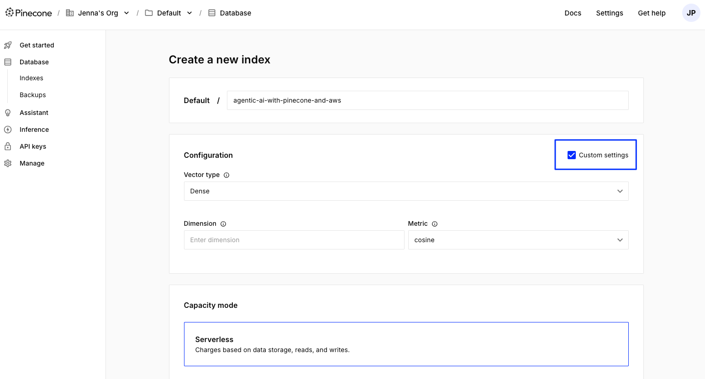

# 1. Create a Pinecone account
==
1. Open a new browser tab outside of Instruct and navigate to https://app.pinecone.io to create a new Pinecone account or to login.
2. Enter your email to login or create a new, free Pinecone account.
3. Once you've created your account, log in.
4. After logging in, you should see a page that looks like this:

# 2. Create a Pinecone index
==
Pinecone indexes are incredibly powerful tools that can handle billions of vectors while returning data at lightning-fast speeds and allowing for quick and efficient data upserting.

Let's dive in and create your first index! In this workshop, we'll do this in the Console, so you can familiarize yourself with it. Later in this workshop, we'll show you how to create an index through a Jupyter notebook as well.

1. Now that you have a Pinecone account, click the "Create index" button in the center of the screen.
2. Give your index the name `agentic-ai-with-pinecone-and-aws`. This is the name of the index we'll use throughout this workshop.
3. In the Configuration section, select the `Custom Settings` checkbox

4. Select the `Dense` for `Vector type`
5. Set the `Dimension` of your index to `1024`. This value determines the size of the vectors your index will handle and needs to match that of the embedding model you use.
6. Set the `Metric` to `cosine`. This value also depends on the embedding model.
7. Select the `Serverless` option for `Capacity mode`
8. Select the `us-east-1` region.
9. Finally, click on the `Create index` button at the bottom.

Your index will be created and you'll be able to view details about its configuration, data, and usage. Pinecone's serverless indexes  provide the best out-of-the-box experience, allowing you to scale to billions of vectors while still being cost-effective.

# 3. Create a Pinecone API key
==

You may have created the default Pinecone API key when setting up your account earlier. You can use that one if you still have it available, otherwise create a new one:

1. Navigate to the `API keys` menu on the left
2. Click the `Create API key` button in the upper right
3. Give your API key a memorable name like `agentic-ai`

4. Click the `Create key` button
5. Copy the API key value and save it somewhere safe for use throughout this workshop. You'll need to set it up in each notebook and to run the webapp. You **will not* be able to get the value later.

# Extra learning
==
## Cosine similarity

Cosine similarity is a widely used measure of similarity between two vectors in a multi-dimensional space. It calculates the cosine of the angle between the vectors, providing a value between -1 and 1. Cosine similarity is particularly useful in various applications, including machine learning, natural language processing, and information retrieval. It offers a measure of how alike two vectors are, focusing on their orientation rather than magnitude.

## Embedding model dimensions

Each embedding model has different dimensions because they are trained to capture different aspects and complexities of the input data. The dimensions of an embedding model determine the size of the vectors it generates. Higher-dimensional embeddings can capture more intricate patterns and relationships in the data, but they also require more computational resources. The choice of dimensions depends on the specific task, the complexity of the data, and the available computational resources. Common dimensions for embedding models range from a few hundred to several thousand.